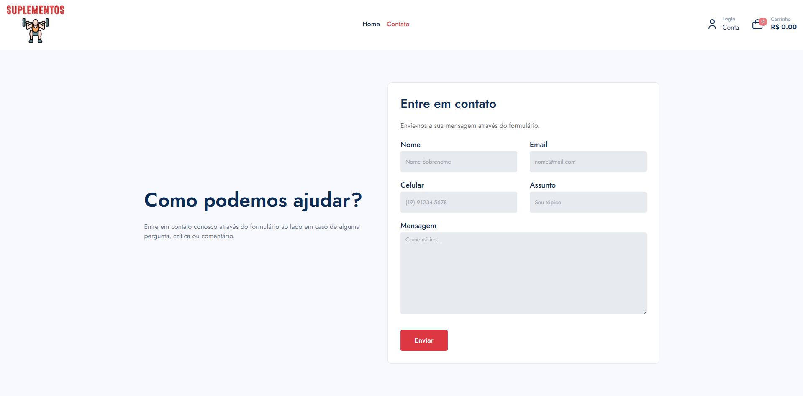
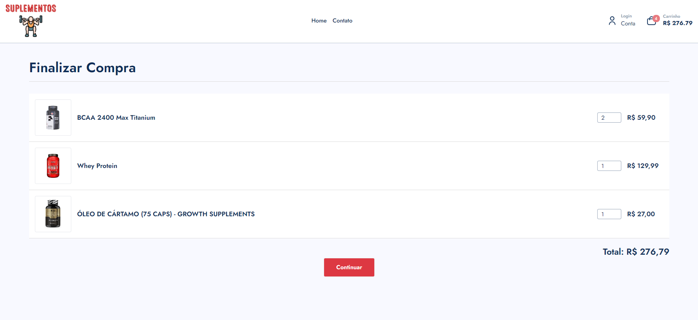
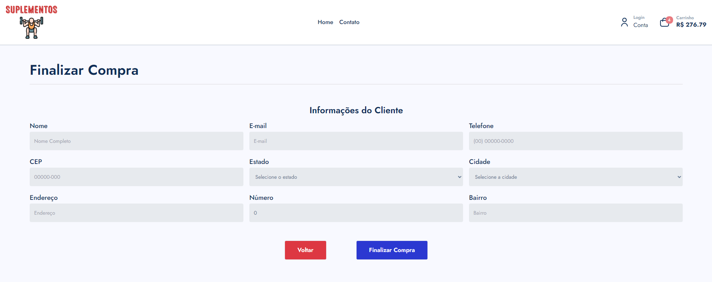
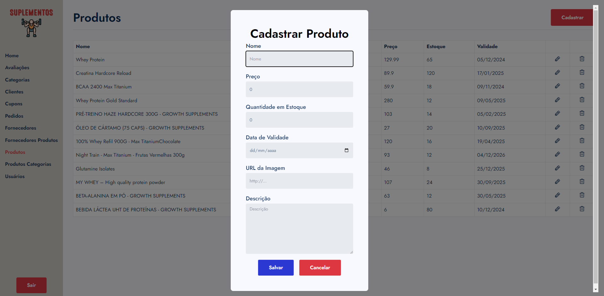
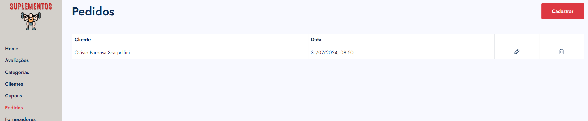

# FATEC - PI 2º - 3° Semestre

Projeto destinado à criação de uma aplicação para o Projeto Integrado no curso de Análise e Desenvolvimento de Sistemas na FATEC.

O site está publicado no Github Pages, sendo possível acessá-lo pela URL https://otavio14.github.io/fatec-pi-2-semestre/ e a API está disponível pela URL https://fobov-java.onrender.com .

## Instalação e inicialização

Siga os passos abaixo para instalar e executar o projeto

**Frontend**

Executar os comandos:

```bash
  cd frontend
  npm i
  npm run dev
```

**Backend**

1. Na pasta `backend-java` é preciso executar o Maven para instalar as dependências
2. Para executar basta usar `spring-boot:run`

## Deploy Backend em Java

1. Excutar o package do Maven
2. Copiar o arquivo JAR para a pasta `host-deploy` junto do `database.db`
3. Com o Docker instalado localmente rodar `docker build -t otavio14/fobov .`
4. No Docker Desktop dar `push` para o Docker Hub
5. No Render em `Manually Deploy` clicar em `Deploy latest reference`
6. Vai ficar disponível na url `https://fobov-java.onrender.com` sem necessidade de definir a porta

# Resultado visual

# Home


# Contato



# Carrinho-lateral


# Página do produto


# Carrinho



# Finalização da compra



# Home do admin


# Registro de produtos



# Recebimento do pedido



## Autores

- [Bruno](https://www.github.com/brunojohannn)
- [Fábio](https://www.github.com/)
- [Otávio Barbosa](https://www.github.com/OtavioBScar)
- [Otávio Rovere](https://www.github.com/Otavio14)
- [Vinicius](https://www.github.com/Vinij77)
